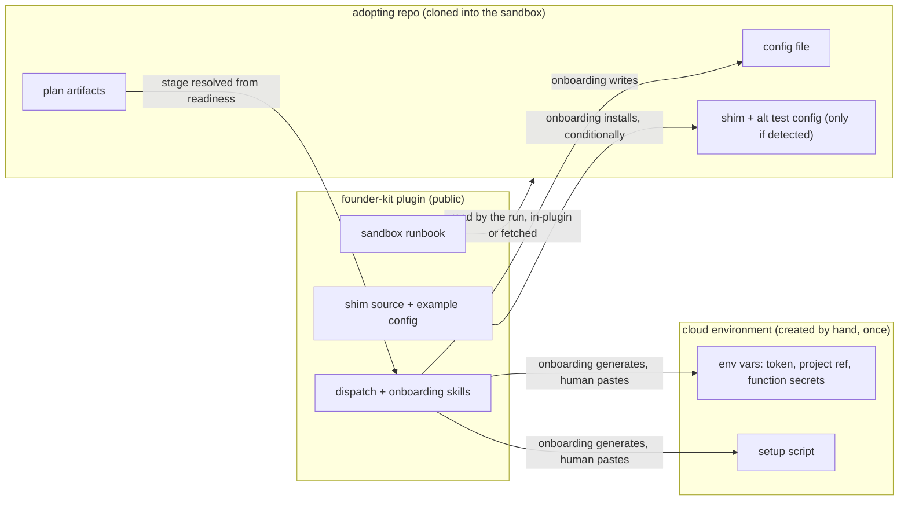
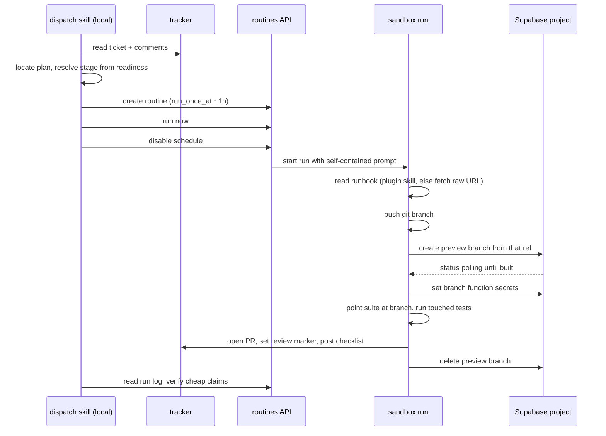
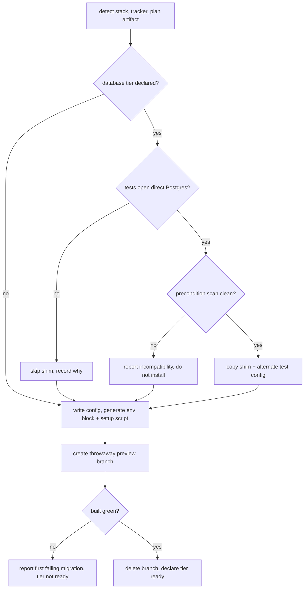

# Cloud Dispatch Plugin - Plan

## Goal Capsule

- **Objective:** A team working a Supabase + Vitest project can hand a planned ticket to a cloud sandbox and get back a PR whose tests actually ran against a real database, with the ticket closed out — without rebuilding the sandbox path for each project.
- **Means:** A published `agent-delivery` plugin with an `onboard` and a `dispatch` skill, carrying the sandbox knowledge and reading per-project facts from config (KTD1).
- **Product authority:** This plan. The first v1 adopter is a second project of Kerry's: same stack, GitHub Issues instead of Linear, Supabase branching already enabled, no successful cloud run yet.
- **Execution profile:** Documentation-and-prompt work in a repository with no test runner and no CI. Proof comes from skill evals plus one live end-to-end dispatch, not from unit tests.
- **Stop conditions:** Stop and report rather than proceeding if a preview branch cannot be built green in the target project (U7), if the routines API cannot fire a run that reaches the repository clone, or if any content proposed for a committed file identifies the source project's business, customers, or secrets.
- **Open blockers:** None. One unknown is scoped as work rather than a blocker: whether the adopting project's repo migrations replay into a git-associated preview branch, which R6 proves before any real dispatch.

---

## Product Contract

**Product Contract preservation:** changed during document review, with user approval — R10 reworded so the runbook fallback covers a failed install rather than expected absence; R23 added to require a minimal, human-confirmed forwarded-secret set; R6 extended so the preflight also runs a database-backed test file green; R22 reworded from an endpoint ban to a consequence-based credential rule, so it no longer forbids the branch-key fetch the run requires; AE4 restated to match R10; F2's coverage list corrected to include R18.

### Summary

A Claude Code plugin, published in the founder-kit marketplace, that dispatches a planned ticket into a Claude cloud sandbox, runs the touched tests against a disposable Supabase preview branch, and returns a PR plus a closed-out ticket. Everything project-specific — tracker, stage map, risk paths, close-out steps, database tier — is declared in a config file in the adopting repo. A guided onboarding skill takes a first-time repo from unprepared to a verified first dispatch.

### Problem Frame

Running a delivery stage in a cloud sandbox works, and the proof is expensive and non-obvious. One project got there over several weeks of probing, and most of what it learned is invisible from the outside: a sandbox has no Docker daemon, so a local database stack is impossible there forever; raw TCP to Postgres does not route, so any test opening a direct connection fails; tools with hand-rolled network dialers hang for forty seconds and fail while `curl` answers instantly; an environment setup script starts outside the repo clone, and getting that wrong kills the session before any agent runs, with nothing in the log to read.

None of that is discoverable by reasoning. Each was found by a run failing in a way that pointed somewhere else. A second project starting today would rediscover the same list at the same cost, because the knowledge currently lives inside one repository's documentation, entangled with that project's ticket ids, domain names, test-file counts and secret inventory.

The setup that remains genuinely manual is about an hour. The problem is not the hour — it is that a newcomer cannot tell which hour to spend, or which of the failures they hit are their fault.

### Key Decisions

- **One plugin carries both the dispatch capability and the database tier; the tier is chosen by config.** (session-settled: user-directed — chosen over two separately installable plugins: neither reference `plugin.json` declares inter-plugin dependencies, so a split forces runtime degradation handling and buys nothing back.) Governs R1, R2.
- **The plugin depends on no planning workflow.** The stage map is config; compound-engineering is its default value, not a requirement. Governs R3, R8.
- **The full close-out ritual ships, switchable off per step.** (session-settled: user-directed — chosen over delivering a PR and leaving tracker housekeeping to the dispatcher: the delivery discipline is the product, the dispatch call is not.) Governs R17, R18.
- **Close-out names a review marker, not a state.** Each tracker implements the same operation its own way — a workflow state in Linear, a project-board column in GitHub. (session-settled: user-directed — chosen over a label or comment-only close-out: a board column is the structural match for a workflow state, so the abstraction stays one operation instead of degrading per tracker.) Governs R17.
- **The runbook lives in the plugin only.** (session-settled: user-directed — chosen over pinning a stamped copy into each adopting repo: once config carries the project-specific facts, nothing project-specific remains in the runbook for a repo copy to hold.) Governs R10.
- **A run that cannot invoke the plugin's skill fetches the file from the public repository rather than installing the plugin.** (session-settled: user-approved — chosen over install-then-retry: whether a mid-session plugin install becomes invocable in that same session is unverified, and a failed retry has no exit.) Governs R10.
- **The shim ships with the plugin but installs conditionally.** (session-settled: user-approved — chosen over omitting it from v1: build cost is near zero, but installing it unconditionally imposes a management-token requirement and a divergent database client on projects that never needed either.) Governs R7, R20, R21.
- **The audience is any founder on a similar stack, not one operator.** (session-settled: user-directed — chosen over tuning defaults to Kerry's own habits: it publishes to a public marketplace.) Governs R4, R5.
- **The firing mechanism sits behind one seam.** The host platform already exposes a one-call remote-agent primitive alongside the scheduled-routine API, so the durable value is the policy layer, not the call. Governs R11.

### Where each piece lives



### Actors

- A1. **Dispatcher** — the local session that resolves the stage, fires the run, and verifies what comes back.
- A2. **Run** — the agent inside the cloud sandbox. Starts with no conversational context and only what the prompt and the runbook give it.
- A3. **Tracker** — the issue system. Read for the brief, written for close-out. Linear and GitHub Issues are the two v1 implementations.
- A4. **Database project** — the production Supabase project, touched only to create and delete disposable branches.

### Requirements

**Packaging and configuration**

- R1. One installable plugin carries both the dispatch capability and the Supabase database tier, with the tier selected per project by configuration.
- R2. Every project-specific fact the dispatch path needs is declared in a config file in the adopting repo, and the plugin ships a documented example.
- R3. The plugin names no planning workflow, tracker, or test runner as a hard dependency; each is a config value with a default.

**Onboarding**

- R4. A first-time adopter reaches a verified first dispatch by following one guided skill, which performs what it can and instructs the human through what it cannot.
- R5. Onboarding generates the cloud environment's variable block and setup script from what it detects in the repo, rather than asking the adopter to compose them.
- R6. Onboarding proves the database tier before any real work is dispatched, by creating a throwaway preview branch, confirming it builds green, running one existing database-backed test file green against it, and deleting it.
- R7. Onboarding installs the Postgres-over-HTTPS shim only when the repo's tests open direct Postgres connections, and states which way it went.
- R8. Onboarding records the stage map — where the readiness signal lives and which skill each stage invokes — defaulting to compound-engineering's artifact when it is present.

**Dispatch**

- R9. The stage is resolved from the planning artifact's readiness state, stated before firing, and overridable by an explicit argument; a stage requiring interactive judgement is refused rather than dispatched.
- R10. The run obtains its runbook by invoking the plugin's skill, which the environment's setup script installs before the agent starts, and falls back to fetching the file from the public repository when that invocation fails.
- R11. The firing mechanism is isolated behind one seam, so it can change without touching stage resolution, the prompt contract, or close-out.
- R12. The dispatched prompt is self-contained: it carries the ticket, its comments, the deliverable, the branch name, and the tier's environment facts, with no secret values.

**What the run does**

- R13. The run halts and reports rather than proceeding when it reaches a risk brake declared in config.
- R14. The run states which verification tier each claim reached and names what it could not run.
- R15. The run provisions its own disposable database, points the suite at it, and deletes it before finishing — including when the run is failing.
- R16. The run opens a pull request and never merges it; blocked work opens a draft with the blocker stated first.

**Close-out**

- R17. On finishing, the run performs the project's declared close-out: set the ticket's review marker through the tracker adapter, post a manual-test checklist, and on a defect ticket record the escape cause and the guard that shipped with the fix.
- R18. Each close-out step is switchable off in config, with all steps on by default.
- R19. The dispatcher verifies the run's claims where verification is cheap and reports with provenance, rather than relaying them as established.

**Safety**

- R20. The shim refuses to run unless its target is verifiably a disposable preview branch of the declared production project, and never the branch named `main`.
- R21. The plugin states the preconditions the shim's correctness depends on and checks them at install time rather than inheriting them as assumptions.
- R22. The run writes to the production project only for branch-lifecycle calls, and never fetches the branch-detail endpoint, which returns a database password it has no use for; credentials it does need are piped straight into the environment and never printed, logged, or echoed into its report.
- R23. The forwarded function-secret set is minimal and human-confirmed: onboarding proposes the keys, marks any whose effect reaches an external side-effecting service, and records the suppression or omission chosen for each before the environment block is generated.

### Key Flows

- F1. Onboarding a repo
  - **Trigger:** An adopter runs the onboarding skill in a repo that has never dispatched.
  - **Actors:** A1, A4
  - **Steps:** Detect stack and tracker; write the config; detect direct Postgres use and install the shim if found; generate the environment variable block and setup script for the human to paste; create a throwaway preview branch and confirm it builds green; delete it; report what is ready and what the human still owes.
  - **Covers R4, R5, R6, R7, R8.**

- F2. Dispatching a ticket at the database tier
  - **Trigger:** The dispatcher is asked to run a ticket whose plan is implementation-ready.
  - **Actors:** A1, A2, A3, A4
  - **Steps:** Fetch the ticket and its comments; locate its plan across branches; resolve and state the stage; compose the prompt; fire; the run pushes a branch, provisions its own preview branch, sets its secrets, points the suite at it, runs the touched tests, opens a PR, deletes its branch, and performs close-out; the dispatcher verifies the cheap claims and reports with provenance.
  - **Covers R9, R10, R11, R12, R13, R14, R15, R16, R17, R18, R19.**

### Acceptance Examples

- AE1. **Covers R7.** Given a repo whose tests reach the database only through the Supabase client, when onboarding runs, then no shim and no alternate test config are installed, and the report says the database tier needs neither.
- AE2. **Covers R21.** Given a repo whose test SQL contains a dollar-quoted function body, when onboarding would install the shim, then it reports the incompatibility instead of installing silently.
- AE3. **Covers R6.** Given a project whose stored migration history does not replay cleanly, when onboarding creates its throwaway branch, then the branch fails, onboarding reports the first failing migration, and dispatch is not declared ready.
- AE4. **Covers R10.** Given a sandbox where the setup script's plugin install did not take, when the run tries to invoke the runbook skill and cannot, then it fetches the runbook from the public repository and proceeds — it does not install the plugin or retry the invocation.
- AE5. **Covers R15.** Given a run that fails partway through its tests, when it ends, then its preview branch is deleted anyway.
- AE6. **Covers R18.** Given a project whose config disables the manual-test checklist, when a run finishes, then it moves the tracker state and posts no checklist.

### Success Criteria

- One ticket in the second project goes from a single dispatch command to a green test run against a preview branch, an open PR, and a closed-out issue, with no intervention after the command.
- Onboarding completes in the adopting repo from a session with no access to the source project's documentation, using only the plugin's own runbook and example config. The unrestricted claim — that any stranger on the same stack succeeds — is a post-v1 goal, not a v1 criterion.
- The sandbox's structural constraints are stated once in the plugin, and no adopting repo carries a copy of them.

### Scope Boundaries

- The source project does not migrate onto the plugin. It continues as it is until the plugin has been used elsewhere for a while, so v1 has one adopter.
- The config format is unstable in v1 and may change without a migration path until a second external adopter exists. The plugin states this outright rather than implying stability by publishing.
- No scheduling or cadence. Dispatch is invoked by a human; recurring routines are a separate concern.
- No automatic creation of the cloud environment. It is a form on a hosted service; the plugin generates its contents and the human pastes them.
- No database tier other than Supabase in v1.
- No dispatch of stages that need question-and-answer with a human.

### Dependencies / Assumptions

- The Claude cloud sandbox keeps its current shape: no Docker daemon, no raw TCP egress, an HTTP proxy that defeats hand-rolled network dialers, and a setup script whose working directory is not the repo clone. These are the invariants the plugin encodes; if they change, the runbook is wrong.
- The founder-kit repository stays public, which is what makes the runbook fetchable as a fallback.
- An adopting project has Supabase branching enabled and the Supabase GitHub integration installed, so preview branches build from the repo's migrations rather than the production project's stored history.
- A project tracked in GitHub Issues has a project board with a column standing for review, since that is where its review marker is set.
- The adopting project's plan artifacts carry a machine-readable readiness signal. Projects without one supply an explicit stage instead.
- The v1 adopter differs from the source project on exactly one axis, so only the tracker abstraction has two proven implementations; every other config key has one.

### Outstanding Questions

**Deferred to Planning**

- Does the second project's test suite open direct Postgres connections? Decides whether v1's proof exercises the shim path at all.
- Whether the platform's remote-agent primitive can target a named cloud environment. If it can, it becomes a candidate for the firing seam (KTD4); if it cannot, it is disqualified for the database tier, because the environment carries the tier's credentials and setup script.

### Sources / Research

Prior art lives in another repository, `greet-88218`, and is the evidence base for the sandbox invariants and the branch choreography. It is source material to generalise from, not a dependency:

- `docs/tech/agent-delivery/README.md` — the probe record: sandbox capabilities, branch economics and lifecycle, the migration-history failure and its repair, the connector decision.
- `docs/tech/agent-delivery/runbook.md` — what a run does inside the sandbox, and the known failure signatures with their fastest diagnosis.
- `.claude/skills/gre-dispatch/SKILL.md` — the dispatch primitive as it exists today, including the rules recorded as earned.
- `test/helpers/pgHttpShim.ts` — the Postgres-over-HTTPS adapter, including the branch-verification guard that should travel verbatim and the project-specific assumptions that should not.

Host platform surface the plugin sits on: a scheduled-routine API (create, run, list runs, read run log), a remote-agent dispatch primitive, and the cloud environment's own variables-and-setup-script form.


---

## Planning Contract

### Key Technical Decisions

- KTD1. **Two skills, `onboard` and `dispatch`, each a directory under `plugins/agent-delivery/skills/`.** Mirrors the compliance plugin's shape and matches the chosen invocation names. Governs R4, R9.
- KTD2. **The adopting repo's config lives at `.agent-delivery/config.yaml`.** Nesting it inside `.compound-engineering/` would recreate the planning-workflow coupling the Product Contract removes. Governs R2, R3.
- KTD3. **The tracker seam is a three-operation contract — read the brief, set the review marker, post a comment — with one instruction file per tracker behind it.** (session-settled: user-directed — chosen over shipping GitHub only in v1: both adapters ship even though the first adopter exercises one.) Governs R17, R18.
- KTD4. **v1 fires through the scheduled-routine API, behind the seam R11 requires.** Its run log is the only debugging surface when a sandbox dies before the agent starts, which the remote-agent primitive has not been shown to provide for this shape. Governs R11.
- KTD5. **The runbook is plugin knowledge, named in the dispatch prompt with a raw-URL fetch fallback.** (session-settled: user-approved — chosen over installing the plugin mid-run and retrying: mid-session plugin registration is unverified and a failed retry has no exit.) Governs R10.
- KTD6. **The shim ships as a plugin asset that onboarding copies into the adopting repo after a precondition scan.** (session-settled: user-approved — chosen over omitting it or installing it unconditionally: it is a vitest alias target, so it must live in the repo, and its correctness rests on preconditions that vary by project.) Governs R7, R20, R21.
- KTD7. **Verification is skill evals plus one live proof run.** founder-kit has no test runner and no CI, so there is no unit tier to write into; the repo's own convention is `evals/evals.json` with committed benchmark snapshots.
- KTD8. **Secrets never enter the repository or the dispatch prompt.** Onboarding generates the environment's variable block for the human to paste into the hosted form and names keys only. Governs R22.

### High-Level Technical Design

Dispatch choreography at the database tier. The branch is created only after the git branch is pushed, because a git-associated preview branch builds from the pushed ref.



Onboarding gates. Each gate reports its outcome rather than failing silently; the tier is only declared ready when the preflight branch has built green and been deleted.



### Output Structure

```
plugins/agent-delivery/
  .claude-plugin/
    plugin.json
  skills/
    _shared/
      sandbox-runbook.md
      config-schema.md
      trackers/
        linear.md
        github.md
    onboard/
      SKILL.md
      detect.md
      environment.md
      database-tier.md
      assets/
        config.example.yaml
        pg-http-shim.ts
        vitest.config.pghttp.ts
      evals/
        evals.json
    dispatch/
      SKILL.md
      stage-resolution.md
      prompt-contract.md
      close-out.md
      evals/
        evals.json
```

### Assumptions

- The routines API's input size cap is smaller than the full instruction set, which is why the runbook is referenced rather than inlined. Confirm the actual cap during U8 and record it in the prompt-contract file.
- A raw file URL on the public repository is reachable from inside a sandbox through its HTTP proxy. U3 records the fallback; U10's proof run is where it is first exercised in anger.
- The adopting project's preview branches build from repository migrations because the Supabase GitHub integration is installed. U7's preflight is what turns this from an assumption into a checked fact per project.

### Sequencing

U1 and U2 come first because every later unit writes into the structure they create. U3, U4 and U5 are independent knowledge units and can proceed in any order. U6 depends on U2 and U3; U7 depends on U5 and U6. U8 depends on U3 and U4. U9 depends on U4 and U8. U10 is last and is the only unit that requires a live project.

---

## Implementation Units

### Unit Index

| U-ID | Title | Key files | Depends on |
|---|---|---|---|
| U1 | Plugin scaffold and marketplace registration | `plugins/agent-delivery/.claude-plugin/plugin.json`, `.claude-plugin/marketplace.json` | — |
| U2 | Project config contract and example | `skills/_shared/config-schema.md`, `skills/onboard/assets/config.example.yaml` | U1 |
| U3 | Sandbox runbook | `skills/_shared/sandbox-runbook.md` | U1 |
| U4 | Tracker adapter contract, Linear and GitHub | `skills/_shared/trackers/*.md` | U1, U2 |
| U5 | Postgres-over-HTTPS shim asset | `skills/onboard/assets/pg-http-shim.ts`, `assets/vitest.config.pghttp.ts` | U1 |
| U6 | `onboard` — detection, config, environment artifacts | `skills/onboard/SKILL.md`, `detect.md`, `environment.md` | U2, U3 |
| U7 | `onboard` — database preflight and conditional shim install | `skills/onboard/database-tier.md` | U5, U6 |
| U8 | `dispatch` — stage resolution, prompt, fire, verify | `skills/dispatch/SKILL.md`, `stage-resolution.md`, `prompt-contract.md` | U3, U4 |
| U9 | Close-out contract | `skills/dispatch/close-out.md` | U4, U8 |
| U10 | Evals and first live proof run | `skills/*/evals/evals.json`, `README.md` | all |

### U1. Plugin scaffold and marketplace registration

**Goal:** The plugin exists, installs, and is discoverable in the marketplace.

**Requirements:** R1.

**Dependencies:** none.

**Files:** `plugins/agent-delivery/.claude-plugin/plugin.json`, `.claude-plugin/marketplace.json`, `README.md`.

**Approach:**
1. Create `plugins/agent-delivery/` with the directory shape in Output Structure.
2. Write `plugin.json` with every field CONTRIBUTING.md requires: `name`, `version`, `description`, `author`, `homepage`, `repository`, `license`, `keywords`, `skills`.
3. Add the plugin object to `.claude-plugin/marketplace.json` alongside `compliance`.
4. Add the README plugins-table row; the details section lands in U10 once the skills exist.

**Patterns to follow:** `plugins/compliance/.claude-plugin/plugin.json` for field shape and `category`; the existing marketplace entry for ordering.

**Test scenarios:** Test expectation: none — scaffolding and registration metadata with no behavior.

**Verification:** `/plugin add agent-delivery@founder-kit` resolves and both skills are listed once U6 and U8 land.

### U2. Project config contract and example

**Goal:** A single documented file in the adopting repo carries every project-specific fact, so no skill hardcodes one.

**Requirements:** R2, R3.

**Dependencies:** U1.

**Files:** `plugins/agent-delivery/skills/_shared/config-schema.md`, `plugins/agent-delivery/skills/onboard/assets/config.example.yaml`.

**Approach:**
1. Define the key set: tracker kind and its review-marker target, stage map (artifact glob, readiness key, value-to-stage mapping, skill per stage), risk-brake paths, database tier on/off, close-out step toggles, clone path and setup commands.
2. Give every key a default, and state which defaults assume compound-engineering so a project without it knows what to override (KTD2). Record the Supabase connector as a stated prerequisite whenever the database tier is on, since the run acquires its branch keys through it.
3. Write `config.example.yaml` as a commented, copy-ready file.
4. State the precedence rule: an explicit argument to a skill beats config; config beats default.
5. Carry a branch instance-size key, so an adopter can match it to their suite's concurrency; test timeout and worker-count overrides applied when the suite targets a branch; and a schema version key. Both skills read it, and warn when they meet a version they do not recognise rather than failing obscurely on a renamed key.

**Patterns to follow:** compound-engineering's `.compound-engineering/config.example.yaml` for the commented-defaults style.

**Test scenarios:**
- Covers R3. A config declaring a non-compound-engineering stage map resolves a stage without any compound-engineering artifact present.
- A config omitting every optional key still resolves, with defaults reported.
- A config naming an unknown tracker kind fails with a message naming the key and the supported values.
- A config carrying an unrecognised schema version produces a version warning naming both versions, not a key-level error.

**Verification:** A reviewer can fill in `config.example.yaml` for a project they know without reading any skill file.

### U3. Sandbox runbook

**Goal:** The knowledge a run needs inside the sandbox lives in one plugin file, carrying no project specifics.

**Requirements:** R10, R13, R14, R15, R16, R22, R23.

**Dependencies:** U1.

**Files:** `plugins/agent-delivery/skills/_shared/sandbox-runbook.md`.

**Approach:**
1. Record the sandbox invariants as the orientation section: no Docker daemon so no local database stack; no raw TCP to Postgres; hand-rolled network dialers hang on the proxy while `curl` works; the setup script's working directory is not the repository clone.
2. Record the database-tier choreography in order: push the git branch, create the preview branch from that ref at the instance size config names — the shim opens one database connection per query, so an undersized branch starves both the shim and the branch's own functions under a parallel suite — poll status by extracting only the status field — a secret-hygiene rule, not a readiness one — poll the branch's applied-migration count until it settles, because the status flag turns green before replay finishes, set branch secrets, obtain the branch's API URL and keys through the Supabase connector's project-URL and publishable-key tools rather than the branch-detail endpoint, point the suite at the branch, run touched tests, delete the branch.
2a. Require the run to confirm the secrets file path is git-ignored and permission-restricted before writing it, and to verify no secret-bearing file is staged before it pushes (R23).
3. State the three credential rules as prohibitions with their reason: never fetch or print a branch-detail endpoint that returns credentials; never write to the production project except for branch create and delete; and never forward the management token to a branch — the forwarded set is exactly what config names, and that token is never exported into branch secrets nor written to the repo's environment file.
4. Record the verification tiers and the deliverable conventions: open a PR, never merge, draft with the blocker first when halted.
5. Record the failure-signature table, fastest diagnosis first.
6. Add the fallback instruction: invoke the skill; if invocation is unavailable, fetch this file from the public repository raw URL and follow it (KTD5).
7. Scrub every project-specific artifact from the source material — file counts, secret inventories, ticket ids, domain names.

**Test scenarios:**
- Covers R22. A reader following the branch-status polling instruction never reaches an endpoint that returns credentials.
- Covers R15. The delete step is reachable from the failure path, not only the success path.
- Covers R23. Following the secret-forwarding step never results in the management token reaching a branch.
- No sentence in the file names a company, product, customer, or ticket identifier.

**Verification:** A reader with no access to the source project can follow the file end to end without encountering an unexplained reference.

### U4. Tracker adapter contract, Linear and GitHub

**Goal:** Both trackers implement one three-operation contract, so close-out is written once.

**Requirements:** R3, R17, R18.

**Dependencies:** U1, U2.

**Files:** `plugins/agent-delivery/skills/_shared/trackers/linear.md`, `plugins/agent-delivery/skills/_shared/trackers/github.md`.

**Approach:**
1. State the contract in `config-schema.md`: read the brief (issue body plus every comment), set the review marker, post a comment.
2. Write the Linear file: read via the Linear connector, review marker is a workflow state named in config.
3. Write the GitHub file: read via `gh`; the review marker is set by adding the issue to the configured project board as an item, then setting that item's status field to the configured option. Board, field and option names are config keys (KTD3).
4. State the missing-target behaviour in one place: when the configured state, board, field or option does not exist, report it and leave the ticket unchanged rather than guessing a substitute. When the issue exists but is not yet an item on the board, add it and then set the field, reporting both actions.

**Test scenarios:**
- Covers R17. With a GitHub project configured, a finished run moves the issue to the named column and leaves it open.
- Covers R17. With Linear configured, a finished run sets the named workflow state.
- Covers R18. With the review-marker step disabled in config, a finished run posts the checklist and changes no state.
- The configured board, field or option does not exist: the run reports it and the issue is unchanged.
- The issue is not yet an item on the configured board: it is added, the field is set, and both actions are reported.
- The brief-read operation returns comments as well as the body, so a comment-carried instruction is not missed.

**Verification:** Adding a third tracker requires one new file and no edit to close-out or dispatch.

### U5. Postgres-over-HTTPS shim asset

**Goal:** The shim and its alternate test config ship as plugin assets, with a preserved safety guard and its preconditions made explicit.

**Requirements:** R20, R21.

**Dependencies:** U1.

**Files:** `plugins/agent-delivery/skills/onboard/assets/pg-http-shim.ts`, `plugins/agent-delivery/skills/onboard/assets/vitest.config.pghttp.ts`.

**Approach:**
1. Port the adapter: a `pg.Client`-shaped object routing SQL over the management query endpoint.
2. Preserve the branch-verification guard exactly — refuse unless the target appears in the production project's branch list, refuse the production ref, refuse the branch named `main`.
3. Replace the source project's verified-once claims with checks or stated preconditions (R21): dollar-quoting in test SQL; transaction semantics; that every statement runs as one fixed database role, so tests connecting as another role are unsupported; that row counts reflect returned rows only, so a write without a returning clause reports zero; and that literal dollar-number tokens outside a parameter position are corrupted by substitution.
4. Keep the transaction no-op behavior but state its precondition in the header — tests that rely on rollback for isolation are not supported.
5. Generalise the statement-rewrite hook: ship it as a documented extension point with the cron-job example, not as a claimed-universal rewrite.

**Patterns to follow:** the source project's `test/helpers/pgHttpShim.ts` header comment style — the divergences are stated at the top, before the code.

**Test scenarios:**
- Covers R20. A target ref equal to the production project ref is refused before any query is issued.
- Covers R20. A target ref absent from the branch list is refused.
- Covers R20. A branch named `main` is refused.
- A caller that skips `connect()` and queries directly is still guarded.
- Covers AE2. Test SQL containing a dollar-quoted body is reported as unsupported rather than silently interpolated.
- Test SQL carrying a literal dollar-number token outside a parameter position is reported by the precondition scan.
- A test asserting a row count on a write without a returning clause is reported as unsupported.
- A `begin`/`commit`/`rollback` statement returns without reaching the network.

**Verification:** The guard cannot be satisfied by environment variables alone — it requires the target to appear in a live branch listing.

### U6. `onboard` — detection, config, environment artifacts

**Goal:** A first-time adopter gets a written config and the exact text to paste into the cloud environment form.

**Requirements:** R4, R5, R8, R23.

**Dependencies:** U2, U3.

**Files:** `plugins/agent-delivery/skills/onboard/SKILL.md`, `plugins/agent-delivery/skills/onboard/detect.md`, `plugins/agent-delivery/skills/onboard/environment.md`.

**Approach:**
1. Write `SKILL.md` with the trigger phrases and the mode routing, following the compliance plugin's structure.
2. `detect.md`: identify test runner, tracker, plan-artifact location and readiness key, install command, whether the repo has a Supabase directory, and how the suite resolves its database target — the environment variable names it reads, and any config that injects dotenv files into the test environment.
3. Write `.agent-delivery/config.yaml` from what was detected, and report every value that was defaulted rather than detected.
4. `environment.md`: generate the variable block and the setup script, naming secret keys without values (KTD8), and state the working-directory trap as the first line of the generated script. The script installs the founder-kit marketplace and this plugin before the agent starts, so skill invocation is the live primary path and the fetch is a real fallback.
5. Classify each candidate function secret by whether its effect reaches an external side-effecting service — mail, payments, SMS, storage — and present the proposed set for human confirmation, recording the suppression or omission chosen for each, before generating the block (R23).
6. State plainly which steps the human must perform in the hosted form, because no skill can perform them.
7. Record any extra credential scopes the configured tracker adapter needs — a GitHub credential writing a project board needs project scope — as required entries in the block.
8. State what the pasted management token can reach: it is account-wide and production-capable, and the environment form's values are readable by anyone with access to that environment. Recommend minting it on an account holding only the projects the plugin should reach, and give the revoke-and-repaste step for a suspected leak.

**Execution note:** This is prompt-and-generation work; prove it by running the skill against a real repository and reading what it writes, not by unit coverage.

**Test scenarios:**
- Covers R5. Run against a repository with a Supabase directory: the generated setup script changes into the clone before installing.
- Covers R8. Run against a repository with compound-engineering plan artifacts: the stage map is written with the readiness key detected, not asked.
- Run against a repository with no recognised plan artifact: the config records an explicit-stage-required setting and says so.
- Covers R22. The generated variable block contains key names and no secret values.
- Covers R23. A repo whose functions read a mail-sending key: onboarding flags it as side-effecting and does not include it in the proposed set without a recorded decision.
- Re-running against an already-configured repository reports what would change instead of overwriting silently.

**Verification:** A human can paste the two generated artifacts into the environment form without editing them, apart from filling in secret values.

### U7. `onboard` — database preflight and conditional shim install

**Goal:** The database tier is proven on the adopting project before any real work is dispatched, and the shim installs only where it is needed and safe.

**Requirements:** R6, R7, R21, R23.

**Dependencies:** U5, U6.

**Files:** `plugins/agent-delivery/skills/onboard/database-tier.md`.

**Approach:**
1. Scan the repository's tests for direct Postgres client use; when absent, skip the shim and record why (R7).
2. When present, run the precondition scan from U5 before copying anything; report and stop on a failure rather than installing (R21).
3. Copy the shim and the alternate test config into paths the config records, so later units and the runbook can name them.
3a. Confirm every path the run will write secrets to is matched by the repo's ignore rules, and refuse to declare the tier ready otherwise (R23).
4. Push a throwaway git branch, then create its preview branch git-associated from that ref, so the preflight exercises the same build source a real dispatch uses. Poll to a terminal state and read the applied-migration count until it settles before judging the schema.
5. Run one existing database-backed test file against the branch with its environment values exported, declare the tier ready only when it passes, and report its runtime against the same file locally so the adopter sees the remote slowdown before their first dispatch.
6. On failure, report the first failing migration, or the failing test and how the suite resolved its target, and declare the tier not ready.
7. Delete both the preview branch and the throwaway git branch in both outcomes.

**Test scenarios:**
- Covers AE1. A repository whose tests use only the Supabase client: no shim installed, and the report says the tier needs none.
- Covers AE3. A project whose migration history does not replay: the first failing migration is named and the tier is not declared ready.
- Covers R6. A successful preflight deletes its branch and confirms deletion.
- Covers R23. A repo that does not ignore the secrets path: the tier is not declared ready, and the report names the missing ignore entry.
- A preflight interrupted after branch creation still deletes the branch.
- A repository with direct Postgres use and a clean precondition scan gets both files copied to the recorded paths.

**Verification:** The tier is reported ready only after a branch has been built green and deleted in that project.

### U8. `dispatch` — stage resolution, prompt, fire, verify

**Goal:** One command takes a ticket from resolution to a fired run and a verified report.

**Requirements:** R9, R10, R11, R12, R15, R19.

**Dependencies:** U3, U4.

**Files:** `plugins/agent-delivery/skills/dispatch/SKILL.md`, `plugins/agent-delivery/skills/dispatch/stage-resolution.md`, `plugins/agent-delivery/skills/dispatch/prompt-contract.md`.

**Approach:**
1. `stage-resolution.md`: read the config's stage map, locate the plan across branches and worktrees before concluding none exists, state the resolved stage before firing, and refuse a stage that needs interactive judgement (R9).
2. `prompt-contract.md`: define what the prompt must carry — ticket, comments, deliverable, branch name, tier facts, runbook pointer with the fetch fallback — and what it must never carry, which is any secret value.
3. `SKILL.md`: the firing sequence behind the seam — create with a future one-shot time, run now, disable the schedule (KTD4) — plus the poll-and-read-log loop.
4. State the verification duty: check the cheap claims independently and report with provenance, distinguishing what the run claimed from what was confirmed (R19). After every run, list the project's preview branches, confirm the run's branch is gone, and delete it when it is not — including when the run ended without a report (R15).
5. Keep every routines-specific detail inside one named section, so a different firing mechanism replaces that section alone (R11).

**Test scenarios:**
- Covers R9. A ticket whose plan is implementation-ready resolves to the implement stage and reports the resolution before firing.
- Covers R9. A ticket with no plan on the current branch but one on a feature branch resolves from the feature branch, not to no-plan.
- Covers R9. A ticket needing interactive judgement is refused with the reason, and no run is fired.
- Covers R12. The composed prompt contains no secret value while naming the tier's variables.
- Covers AE4. A run reporting that skill invocation failed shows the runbook fetched from the public URL.
- Covers R19. A run claiming a passing PR is reported as claimed-then-verified, with the verification named.
- A fired run absent from the run listing is diagnosed as a pre-session failure, not retried blindly.
- Covers R15. A run that died before its own cleanup leaves a branch; the dispatcher's post-run listing finds it, deletes it, and reports the orphan.

**Verification:** Replacing the firing section with a different mechanism requires no change to stage resolution, the prompt contract, or close-out.

### U9. Close-out contract

**Goal:** A finished run completes its own ticket, and each step can be switched off.

**Requirements:** R17, R18.

**Dependencies:** U4, U8.

**Files:** `plugins/agent-delivery/skills/dispatch/close-out.md`.

**Approach:**
1. Define the three steps and their order: set the review marker, post the manual-test checklist, and on a defect ticket record the escape cause and the guard shipped with the fix.
2. Read each step's on/off value from config, defaulting to on (R18).
3. Specify the checklist shape: click-by-click checkboxes plus a statement of what automated coverage already exists.
4. State the degradation for a project with no defect-recording practice: skip the third step and say so in the report, rather than inventing a record format.
5. Route every tracker call through the U4 contract; name no tracker directly here.

**Test scenarios:**
- Covers AE6. With the checklist step disabled, a finished run sets the review marker and posts nothing.
- Covers R17. A defect ticket in a project with defect recording enabled gets the cause and guard recorded.
- A defect ticket in a project without that practice completes the first two steps and reports the skip.
- A close-out where the tracker call fails leaves the PR open and reports the failure rather than retrying silently.

**Verification:** Turning every close-out step off leaves a run that opens a PR and touches the tracker not at all.

### U10. Evals and first live proof run

**Goal:** Both skills have committed eval prompts, and the whole path is proven once end to end.

**Requirements:** R4, R6, R9, R15, R17.

**Dependencies:** U1 through U9.

**Files:** `plugins/agent-delivery/skills/onboard/evals/evals.json`, `plugins/agent-delivery/skills/dispatch/evals/evals.json`, `README.md`.

**Approach:**
1. Write eval prompts covering the branch points a reader cannot check by reading: shim skipped versus installed, preflight red versus green, stage refused versus resolved, close-out steps off versus on.
2. Run one iteration, then copy `benchmark.json` and `benchmark.md` into each skill's `evals/` directory; leave the workspace untracked.
3. Onboard the second project for real and dispatch one ticket end to end.
4. Record what the run could not do and why, in the plan's own terms, so the next adopter inherits it.
5. Complete registration: the README plugin-details section with example invocations.

**Execution note:** The live run is the load-bearing proof. Treat a green eval suite with no live run as incomplete.

**Test scenarios:**
- Covers AE1, AE3, AE4, AE6 as eval prompts with asserted outcomes.
- The live run produces a PR, a green test run against a preview branch, a set review marker, and a deleted branch.
- The live run's preview branch is confirmed absent after the run ends.

**Verification:** The second project reaches a merged-ready PR from one dispatch command, and the plugin's README describes what a stranger would install.

---

## Verification Contract

founder-kit has no test runner, no CI workflows, and no build step, so verification is documentary, eval-based, and live (KTD7).

- **Structural:** every `SKILL.md` carries valid frontmatter with `name` and `description`; `plugins/agent-delivery/.claude-plugin/plugin.json` carries every field CONTRIBUTING.md lists; the plugin appears in `.claude-plugin/marketplace.json` and in the README table.
- **Content:** no committed file names a company, customer, product, ticket identifier, or secret value. This is the repo's own PR-checklist item and the constraint the whole port turns on.
- **Behavioral:** one eval iteration per skill via the repo's `evals/evals.json` convention, with `benchmark.json` and `benchmark.md` committed into each skill's `evals/` directory and the workspace left untracked.
- **Live:** one end-to-end dispatch in the second project producing a PR, tests run against a preview branch, a set review marker, and a confirmed-deleted branch. A green eval suite without this is not a pass.
- **Cold-start:** onboarding run once from a session denied the source project's documentation, with every point where the operator needed outside knowledge recorded and folded back into the skill.
- **Install:** `/plugin add agent-delivery@founder-kit` resolves and both skills appear.

---

## Definition of Done

**Global**

- Every requirement R1 through R22 is either implemented or named in Scope Boundaries as deferred.
- The Verification Contract's five checks pass, including the live run.
- No committed file carries source-project specifics; the content check is run against the final diff, not an early draft.
- The README table row and plugin-details section are present, per the repo's PR checklist.
- Abandoned approaches are removed. A long run accumulates half-written instruction files and superseded asset copies; the diff contains none.
- Open Questions in this plan are either resolved in place or still marked deferred with their reason.

**Per unit**

- The unit's stated Verification outcome holds.
- Every test scenario listed for the unit is either exercised as an eval prompt or explicitly recorded as not-yet-exercised with the reason.
- Units that change a shipped instruction file leave that file readable standalone — a reader who opens only that file is not left with a dangling reference.
